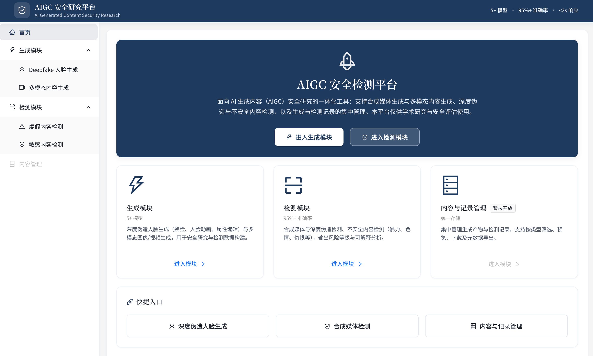
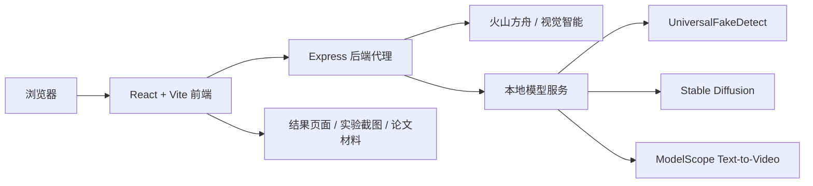

# DScan — AIGC 安全研究平台


DScan 是一个面向 AIGC 安全研究的前后端分离平台，把 **内容生成、深度伪造检测、不安全内容审核、结果记录** 放在同一条研究链路中。它不是单个模型 Demo，而是用于构建样本、调用多源模型、对比检测结果并沉淀实验材料的一体化工具。

<p align="center">
  
</p>

<p align="center">
  <a href="#核心能力">核心能力</a> ·
  <a href="#系统架构">系统架构</a> ·
  <a href="#快速开始">快速开始</a> ·
  <a href="#本地开发指南">本地开发指南</a> ·
  <a href="#部署指南">部署指南</a> ·
  <a href="#环境变量">环境变量</a> ·
  <a href="#安全边界">安全边界</a>
</p>

## 核心能力

| 场景 | 已接入能力 | 价值 |
| --- | --- | --- |
| AIGC 样本构建 | 人脸替换、人脸动画、属性编辑、文生图、文生视频、图生视频 | 为检测实验提供可控生成样本 |
| 虚假内容检测 | 图像 AI 生成检测、视频 AI 生成检测、本地 UniversalFakeDetect | 对合成媒体和伪造图像进行统一送检 |
| 内容安全审核 | 图像/视频敏感内容检测 | 输出风险标签、原因说明与处置建议 |
| 结果管理 | 生成结果、检测记录、样本预览与回看 | 让实验过程可复盘、可展示 |

## 为什么做成平台

| 普通模型 Demo | DScan |
| --- | --- |
| 只验证一个模型或接口 | 统一编排云端接口与本地模型 |
| 密钥和调用逻辑容易散落在前端 | 后端代理集中管理密钥与模型入口 |
| 生成、检测、记录彼此割裂 | 从样本构建到检测分析形成闭环 |
| 结果难以沉淀为论文材料 | 页面截图、实验样本与论文材料集中在 `docs/` |

## 系统架构



## 快速开始

```bash
npm install
npm run dev:all
```

默认服务：

| 服务 | 地址 | 说明 |
| --- | --- | --- |
| 前端 | `http://localhost:53177` | Vite 开发服务 |
| 后端 | `http://localhost:3001` | 代理外部 API 与本地模型 |

也可以分两个终端启动：

```bash
npm run dev:proxy
npm run dev
```

> 只查看页面可以直接启动前端；真实生成、检测和审核能力需要配置 `.env.local`。

## 本地开发指南

### 1. 准备环境

| 依赖 | 用途 |
| --- | --- |
| Node.js | 运行 React 前端与 Express 后端 |
| npm | 安装前端和后端依赖 |
| Python / Uvicorn | 仅在启动本地模型服务时需要 |

### 2. 配置本地密钥

在项目根目录创建或更新 `.env.local`，填入火山接口密钥和可选本地模型地址。只做页面调试时可以先跳过密钥配置；涉及真实生成、检测、审核的功能会依赖后端环境变量。

### 3. 启动开发服务

推荐分终端启动，便于分别查看前后端日志：

```bash
# Terminal 1: 后端代理
npm run dev:proxy

# Terminal 2: 前端页面
npm run dev
```

开发环境请求链路：

```text
浏览器页面 -> /api -> Vite proxy -> http://localhost:3001 -> 外部 API / 本地模型服务
```

`src/main.tsx` 会在开发模式启动 MSW，未命中的请求会继续走真实后端。如果某个接口没有打到 `server/index.cjs`，优先检查 `src/mocks/handlers.ts` 是否拦截了同名路径。

### 4. 开发时常用检查

| 问题 | 检查点 |
| --- | --- |
| 页面打不开 | 确认 Vite 输出的端口，默认是 `53177`，占用时可能自动切换 |
| 后端无响应 | 确认 `npm run dev:proxy` 正在运行，端口为 `3001` 或 `.env.local` 中的 `DETECT_PROXY_PORT` |
| 修改后端未生效 | `server/index.cjs` 无热更新，需要重启 `npm run dev:proxy` |
| 真实接口报错 | 检查 `.env.local` 密钥、模型 endpoint、本地模型服务端口 |
| 生产地址不对 | `.env.production` 只在 `npm run build` 时写入，修改后必须重新构建 |

## 环境变量

后端读取项目根目录的 `.env.local`。密钥只应保存在本地或服务器环境中，不要写入前端代码。

```bash
# 后端代理
DETECT_PROXY_PORT=3001

# 火山方舟：多模态理解、AI 生成检测、文生图/视频等
VOLC_ARK_API_KEY=your_ark_api_key
VOLC_ARK_VISION_MODEL=your_vision_model_or_endpoint

# 火山视觉智能：人脸融合等能力
VOLC_ACCESS_KEY=your_access_key
VOLC_SECRET_KEY=your_secret_key

# 可选：本地模型服务
UNIVERSAL_FAKE_DETECT_URL=http://127.0.0.1:8008
STABLE_DIFFUSION_SERVICE_URL=http://127.0.0.1:8009
MODELSCOPE_T2V_URL=http://127.0.0.1:8011
```

更多模型默认值和可选环境变量见 `server/config.cjs`。

## 本地模型服务

外部接口可独立使用；如果要验证本地模型，再按需启动下面的服务。

| 模型服务 | 端口 | 启动命令 |
| --- | ---: | --- |
| UniversalFakeDetect | `8008` | `cd model/UniversalFakeDetect && pip install -r requirements-api.txt && uvicorn api:app --host 0.0.0.0 --port 8008` |
| Stable Diffusion | `8009` | `cd model/stable-diffusion && pip install -r requirements.txt && uvicorn server:app --host 0.0.0.0 --port 8009` |
| ModelScope T2V | `8011` | `cd model/ModelScopeT2V && pip install -r requirements.txt && uvicorn server:app --host 0.0.0.0 --port 8011` |

首次启动本地大模型可能会下载权重，请预留网络、显存、内存和磁盘空间。

## 项目结构

```text
aigc-security/
├── src/                  # React 前端：页面、组件、路由、请求封装
├── server/               # Express 后端代理与接口注册
├── model/                # 本地模型服务封装
├── datasets/             # 实验样本与数据集
├── public/mock/          # 前端演示用静态资源
├── docs/                 # 论文、答辩材料、实验截图
├── 快速部署.sh           # 前端静态部署脚本
└── deploy-backend.sh     # 后端部署脚本
```

## 部署指南

部署分为两部分：**先部署后端代理，再用正确的后端地址构建并部署前端**。

### 1. 后端部署

```bash
chmod +x deploy-backend.sh
./deploy-backend.sh
```

部署前确认：

| 检查项 | 说明 |
| --- | --- |
| Node.js | 服务器需要能运行 Express 后端 |
| `.env.local` | 服务器后端环境中必须配置真实 API 密钥 |
| 端口 | 默认后端端口为 `3001`，不要被其他服务占用 |
| 脚本配置 | `deploy-backend.sh` / `deploy-backend.exp` 中的服务器地址、用户和路径需与目标机器一致 |

### 2. 前端部署

生产前端的 API 地址在构建时写入 `.env.production`：

```bash
VITE_API_BASE=http://your-server:3001
```

然后执行：

```bash
chmod +x 快速部署.sh
./快速部署.sh
```

`快速部署.sh` 会先执行 `npm run build`，再发布 `dist/` 静态资源。

### 3. 部署顺序

```text
1. 部署或重启后端代理
2. 确认 http://your-server:3001 可访问
3. 更新 .env.production 中的 VITE_API_BASE
4. 执行 ./快速部署.sh
5. 访问前端页面并验证生成、检测、记录页面
```

### 4. 脚本说明

| 脚本 | 作用 |
| --- | --- |
| `快速部署.sh` | 构建并发布前端静态资源 |
| `deploy-backend.sh` | 部署 Node 后端代理 |

如果要公开仓库，建议把部署脚本中的服务器地址、账号、密码等私有信息迁移到本地配置或 CI/CD Secret 中。

## 安全边界

本项目仅用于毕业设计、学术研究和安全评估。

- 不得用于伪造、冒充、骚扰或传播真实个人的不当内容。
- 生成内容和检测结论应在展示材料中明确标注来源与实验条件。
- 外部 API 调用可能产生费用，测试时请控制请求频率。
- 若复用第三方模型、数据集或云服务，请遵守对应许可协议与平台规则。

## License

本仓库为学术研究项目。复用代码、模型或第三方接口时，请同时遵守相关开源许可和服务条款。
